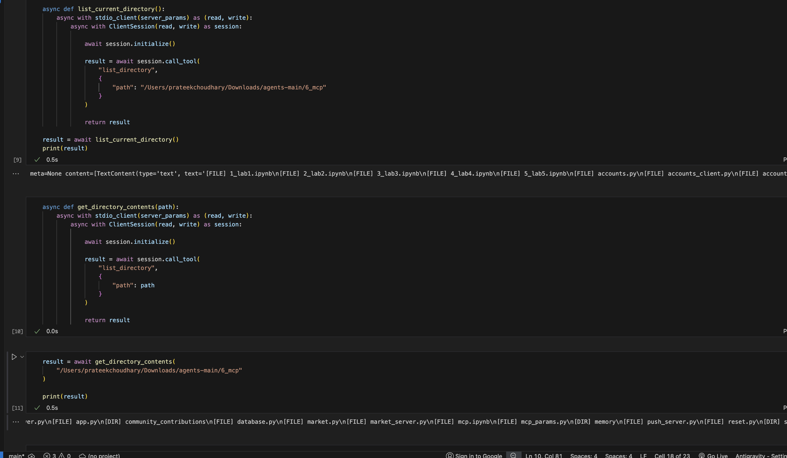

# RepoMind: Repository Intelligence Agent using MCP And OLLAMA


RepoMind is a local AI-powered repository analysis agent that combines the Model Context Protocol (MCP) with Ollama-hosted Large Language Models to inspect, understand, and analyze software projects.

The system leverages MCP Filesystem tools to interact with project directories and source code while using Qwen 2.5 running locally through Ollama to reason about repository structure, code organization, and project architecture.

Unlike traditional code analysis tools, RepoMind uses natural language reasoning over real-time filesystem information to provide intelligent project understanding.

---

## Overview

RepoMind demonstrates how MCP servers can be integrated with local LLMs to create intelligent software engineering assistants.

The project enables:

* MCP Filesystem Server Integration
* Dynamic Tool Discovery
* Tool Execution through MCP
* Repository Exploration
* Source Code Inspection
* AI-Powered Project Understanding
* Fully Local Execution with Ollama

---

## Workflow

```text
User Query
     │
     ▼
┌─────────────────────┐
│     Ollama/Qwen     │
└──────────┬──────────┘
           │
           ▼
┌─────────────────────┐
│    MCP Client       │
└──────────┬──────────┘
           │
           ▼
┌─────────────────────┐
│ Filesystem MCP      │
│      Server         │
└──────────┬──────────┘
           │
           ▼
   Repository Files
           │
           ▼
     Source Code
           │
           ▼
     AI Analysis
```

---

## Features

### MCP Filesystem Integration

Connects to the MCP Filesystem Server using standard MCP communication protocols.

### Tool Discovery

Automatically discovers available filesystem tools including:

* read_file
* write_file
* edit_file
* list_directory
* directory_tree
* search_files
* get_file_info

### Repository Exploration

Allows the agent to:

* Inspect project directories
* Identify source files
* Explore repository structure

### Source Code Analysis

Reads source code through MCP and provides:

* File summaries
* Project understanding
* Architecture insights
* Repository-level reasoning

### Local LLM Execution

Uses:

* Ollama
* Qwen 2.5

for completely local AI inference without external APIs.

---

## Technologies Used

### AI & Agents

* Ollama
* Qwen 2.5

### MCP

* Model Context Protocol (MCP)
* MCP Python SDK
* MCP Filesystem Server

### Development

* Python 3.10
* Jupyter Notebook
* AsyncIO

---

## Project Structure

```text
RepoMind/
│
├── mcp.ipynb
├── README.md
├── requirements.txt
│
└── info.png
```

---

## MCP Tools Discovered

During execution, RepoMind successfully connected to the Filesystem MCP Server and discovered the following tools:

```text
read_file
read_text_file
read_media_file
read_multiple_files
write_file
edit_file
create_directory
list_directory
list_directory_with_sizes
directory_tree
move_file
search_files
get_file_info
list_allowed_directories
```

---

## Example Capabilities

### Repository Inspection

The agent can:

* List project directories
* Discover Python files
* Analyze repository structure

### File Reading

Using MCP tools, the agent can:

* Read source code
* Inspect project files
* Extract relevant information

### Project Understanding

The agent can generate:

* Project summaries
* Architecture descriptions
* Component explanations
* Repository insights

---

## Sample Execution

### Tool Discovery

```text
Available Tools:

- read_file
- write_file
- edit_file
- list_directory
- directory_tree
...
```

### Repository Analysis

```text
The project contains several Python scripts,
Jupyter notebooks, utility modules, server
components, and database-related files.

The repository appears to implement a
trading and market simulation platform.
```

---

## Screenshot

### MCP Workflow Execution



---

## Key Learnings

This project provided hands-on experience with:

* Model Context Protocol (MCP)
* MCP Server Architecture
* Tool Discovery and Execution
* Local LLM Deployment
* Ollama Integration
* Agent Tool Use
* Repository Intelligence Systems
* AI-Assisted Code Understanding

---

## Future Enhancements

Potential future improvements include:

* Automatic Repository Summarization
* Multi-File Dependency Analysis
* Codebase Documentation Generation
* Project Architecture Visualization
* Playwright MCP Integration
* Autonomous Tool Selection
* Multi-Agent MCP Workflows

---

## Author

**Prateek Choudhary**

Built as an exploration of MCP-based AI agents, repository intelligence systems, and local LLM-powered software engineering workflows using Ollama and Qwen 2.5.
